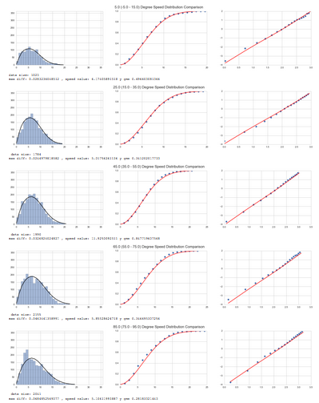
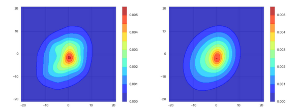
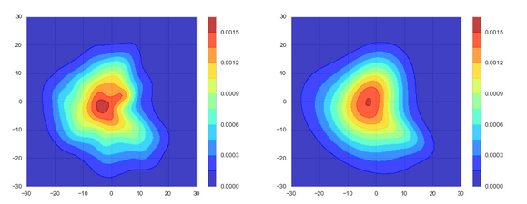
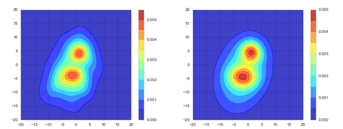
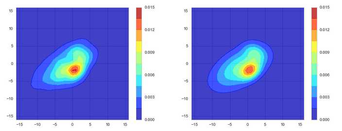
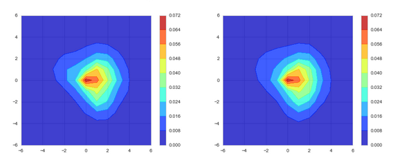
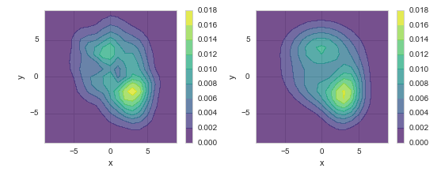
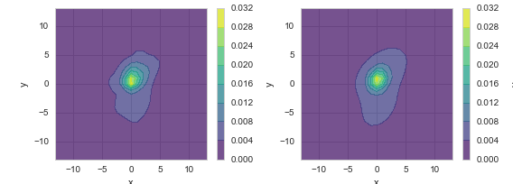

# A Joint Probability Model for Wind Speed and Direction, by Gaussian Mixture Models

## What is this?

This is a Python program for modelling the joint distribution of wind speed and direction.

The method is based on:

1. Harris, Cook, The parent wind speed distribution: Why Weibull?, http://www.sciencedirect.com/science/article/pii/S0167610514001056

2. Gaussian Mixture Models, http://scikit-learn.org/stable/modules/mixture.html

## Fitting Effect

### 1. PDF (Probability Density Function) Comparison

Left: Empirical PDF, Right: Model PDF

### 2. Sectoral Comparison

Left: Histogram vs. Model, Middle: Empirical vs. Model CDF, Right: Weibull ECDF Vs. Model CDF

### 3. Live Demo

The above results are avaiable at
https://cdn.rawgit.com/cqcn1991/Wind-Speed-Analysis/master/output_HTML/marham.html
, along with other analysis.

## Gallery

Here is how the method analysis different locations across the world.
You can use the code toggle button and sidebar to navigate these reports.

[Marham, UK](https://cdn.rawgit.com/cqcn1991/Wind-Speed-Analysis/master/output_HTML/marham.html)

[Tiree, UK](https://cdn.rawgit.com/cqcn1991/Wind-Speed-Analysis/master/output_HTML/tiree.html)

[Vatry, France](https://cdn.rawgit.com/cqcn1991/Wind-Speed-Analysis/master/output_HTML/vatry.html)

[Landsberg Lech, Germany](https://cdn.rawgit.com/cqcn1991/Wind-Speed-Analysis/master/output_HTML/landsberg_lech.html)

[Narrandera, Australia](https://cdn.rawgit.com/cqcn1991/Wind-Speed-Analysis/master/output_HTML/narrandera.html)

[Melita Man, Canada](https://cdn.rawgit.com/cqcn1991/Wind-Speed-Analysis/master/output_HTML/melita_man.html)

[Mildred Lake Alta, Canada](https://cdn.rawgit.com/cqcn1991/Wind-Speed-Analysis/master/output_HTML/mildred_lake_alta.html)

[Luogang, China](https://cdn.rawgit.com/cqcn1991/Wind-Speed-Analysis/master/output_HTML/luogang.html)

[Shanghai, China](https://cdn.rawgit.com/cqcn1991/Wind-Speed-Analysis/master/output_HTML/hongqiao_intl.html)

[Paya Lebar, Singapore](https://cdn.rawgit.com/cqcn1991/Wind-Speed-Analysis/master/output_HTML/paya_lebar.html)

## Getting Started

### 1. Install Anaconda

Download at
https://www.continuum.io/downloads

This repo use Python 2.7, so you should use the 2.7 version

### 2. Additional Environment Configuration

After installing Anaconda, there are still some additional packages need to install:

1. Seaborn
https://github.com/mwaskom/seaborn/
2. Windrose
https://github.com/scls19fr/windrose
3. jsmin
https://github.com/tikitu/jsmin

Just run these in your command line to install them

    pip install seaborn
    pip install windrose
    pip install jsmin

### 3. Download the current repo

### 4. Start Jupyter Notebook, open the `GMM.ipynb`, start playing with it

If you have any question, you could post it at
https://github.com/cqcn1991/Wind-Speed-Analysis/issues
or mail me at 38306608#qq.com