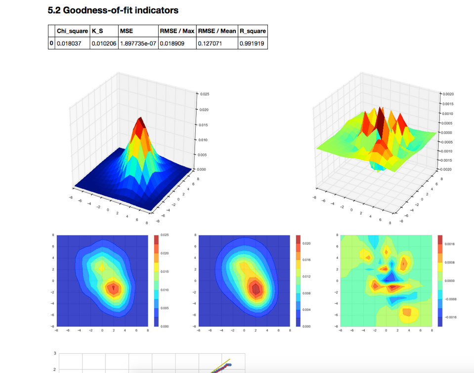

#### Demo

This is a result running the notebook.

https://cdn.rawgit.com/cqcn1991/Wind-Speed-Analysis/master/output_HTML/marham.html

## Getting Started, for first-time Python Users

#### 1. Install Anaconda

Download at
https://www.continuum.io/downloads

This repo use Python 2.7, so you should use the 2.7 version

#### 2. Additional Environment Configuration

After installing Anaconda, there are still some additional packages need to install:

1. Seaborn
https://github.com/mwaskom/seaborn/
2. Windrose
https://github.com/scls19fr/windrose
3. jsmin
https://github.com/tikitu/jsmin

Just run

    pip install seaborn
    pip install windrose
    pip install jsmin

in your command line to install them

#### 3. Download the current repo

#### 4. Run the Jupyter Notebook, and open the file

If you have any question, you could post it at
https://github.com/cqcn1991/Wind-Speed-Analysis/issues
or mail me at 38306608#qq.com