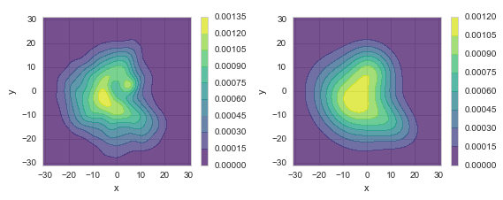
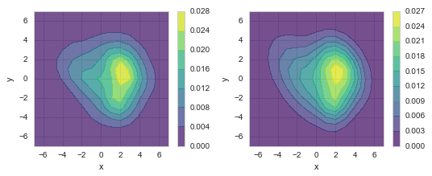

# A Joint Probability Model for Wind Speed and Direction (Gaussian Mixture Models)

## What is this?

This is a Python program for modeling the joint distribution of wind speed and direction.

The method is based on:

1. Harris, Cook, The parent wind speed distribution: Why Weibull?, http://www.sciencedirect.com/science/article/pii/S0167610514001056

2. Gaussian Mixture Models, http://scikit-learn.org/stable/modules/mixture.html

## Fitting Effect

### 1. PDF (Probability Density Function) Comparison

Left: Empirical PDF, Right: Model PDF

### 2. Sectoral Comparison

Left: Histogram vs. Model, Middle: Empirical vs. Model CDF, Right: Weibull ECDF Vs. Model CDF

### 3. Live Demo

The above results are avaiable at
https://cdn.rawgit.com/cqcn1991/Wind-Speed-Analysis/master/output_HTML/marham.html
, along with other analysis.

## Gallery

Here is how the method analysis different locations across the world.
You can use the code toggle button and sidebar to navigate these reports.

[Marham, UK](https://cdn.rawgit.com/cqcn1991/Wind-Speed-Analysis/master/output_HTML/marham.html)

[Tiree, UK](https://cdn.rawgit.com/cqcn1991/Wind-Speed-Analysis/master/output_HTML/tiree.html)

[Vatry, France](https://cdn.rawgit.com/cqcn1991/Wind-Speed-Analysis/master/output_HTML/vatry.html)

[Landsberg Lech, Germany](https://cdn.rawgit.com/cqcn1991/Wind-Speed-Analysis/master/output_HTML/landsberg_lech.html)

[Luogang, China](https://cdn.rawgit.com/cqcn1991/Wind-Speed-Analysis/master/output_HTML/luogang.html)

[Shanghai, China](https://cdn.rawgit.com/cqcn1991/Wind-Speed-Analysis/master/output_HTML/hongqiao_intl.html)

[Paya Lebar, Singapore](https://cdn.rawgit.com/cqcn1991/Wind-Speed-Analysis/master/output_HTML/paya_lebar.html)

## The Probability Model

The model I'm using is Gaussian Mixture Model, or simply put, the sum of some normal distributions. The idea is very simple:

#### 1. For a certain wind character, the wind vector (speed and direction) follows the normal distribution:

#### 2. For specific location, its wind speed direction distribution is composed of several such wind characters, and hence the sum of several normal distributions:

fi is the PDF of normal distribution component, pi is its weight.

The chief beauty of this model is its elegance (simplicity). You can use such a simple model (GMM) to describe wind, contrary to previous Weibull combination and others. 

For a complete explanation of how GMM fit the joint distribution of wind speed and direction, you can read 

> Harris, Cook, The parent wind speed distribution: Why Weibull?, http://www.sciencedirect.com/science/article/pii/S0167610514001056

And I'm also working on a paper about it, this is my Master Thesis. And if you have any interest (question, collaboration...) feel free to ask me. I open source the project is meant to help you try it.

## How to use it

### 1. Install Anaconda

Download at
https://www.continuum.io/downloads

This repo use Python 3, so you should use the 3 as well.

### 2. Additional Environment Configuration

After installing Anaconda, there are still some additional packages you need to install:

Just run these in your command line to install them

    pip install -r requirements.txt

or

    pip install seaborn # https://github.com/mwaskom/seaborn/
    pip install windrose # https://github.com/scls19fr/windrose
    pip install jsmin # https://github.com/tikitu/jsmin
    pip install joblib

### 3. Download the current repo

### 4. Start Jupyter Notebook, open the `GMM.ipynb`, and start playing with it

You may need some datasets to get started. For this reason,  I have include some in
https://github.com/cqcn1991/Wind-Speed-Analysis/tree/master/data
If you want additional data, you can find them at http://www.ncdc.noaa.gov/

If you have any question, you could post it at [issue](https://github.com/cqcn1991/Wind-Speed-Analysis/issues), or mail me at 38306608#qq.com

## Acknowledgement

This work would be impossible without the help from Harris and Cook. Thank you!